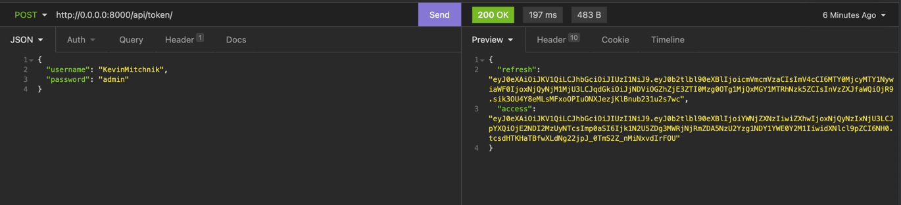
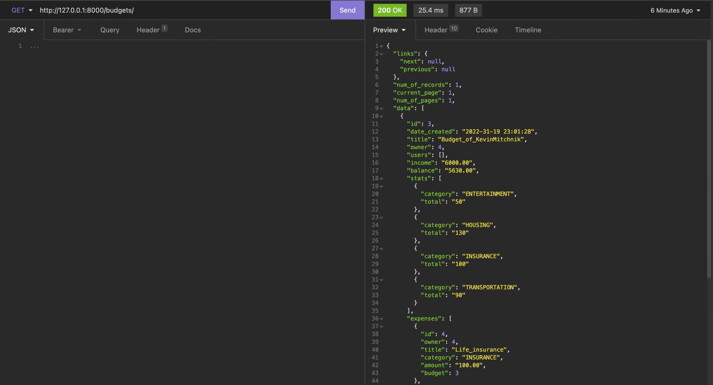
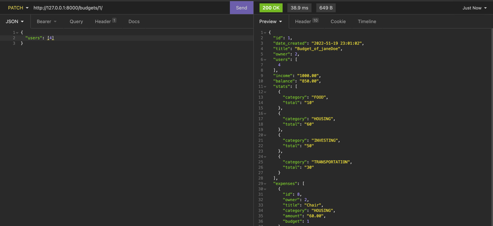
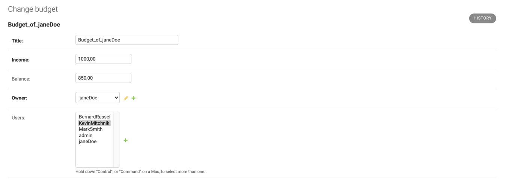
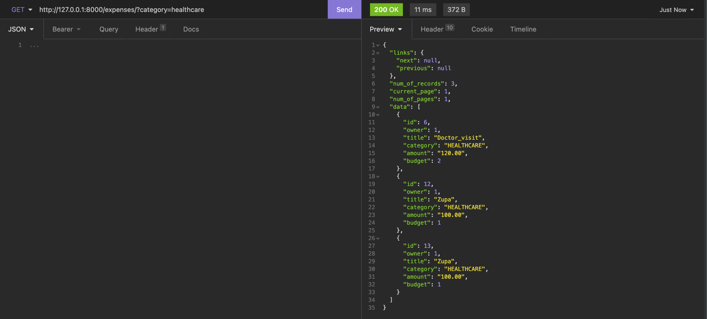

## Budget-service

### Introduction
Budget-service is small Django REST applications, which helps to create simple budgets.

### Installation
Please follow steps:
1) `git clone https://github.com/KonradMarzec1991/budget_service.git`
2) `docker-compose up --build`

Fixtures and migrations will be done automatically.
Fixtures will be applied to db only once.
If you do not need any inital data, please comment line `python manage.py load_fixtures` in `entrypoint_local.sh`.

### Usage

#### Authorization
Application uses `simple_jwt` for authorization.
To get token (valid for 1 day), post username and password on
`http://0.0.0.0:8000/api/token/`

#### Models

API uses two models: `Budget` and `Expenses`.

Budget consists of two three major parts: income, expenses and balance. Newly created budget sets balance equal to income.
Balance field is automatic and it is updated everytime income or expenses are added, updated or deleted.
Many expenses can be linked to one budget.

Budget and expenses are connected with `User` model.

#### API example usage
After getting token, user gets access endpoints (budgets/expenses).

To share budget with someone else, patch budget by adding id of user in `users` body.
In this case, user `janeDoe (id=2)` grants access to her budgets to `kevinMitchnik (id=4)`.

Below, user `kevinMitchnik (id=4)` can see budgets of `janeDoe (id=2)`

This is also visible in admin panel.

Newly added user can modify budget and adds expenses, but cannot remove current ones.
If you want to remove user' access, `PATCH` budgets API (in body remove `id`).

#### Filters example
Filters are applied to almost all fields of budget and expense.
Available filters for `Budget`:
1) created_before/created_after
2) min_income/max_income
3) title
4) q (any of title or expense_title or expense_category)
5) min_balance/max_balance

Available filters for `Expenses`:
1) created_before/created_after
2) min_amount/max_amount
3) title
4) q (expense_title or expense_category)

Example:

#### Deployment
For production deployment, please run `docker-compose.production.yml` with `entrypoint.sh` script.

#### Tests
Please install virtualenv with dependencies or use `make docker-test`.
